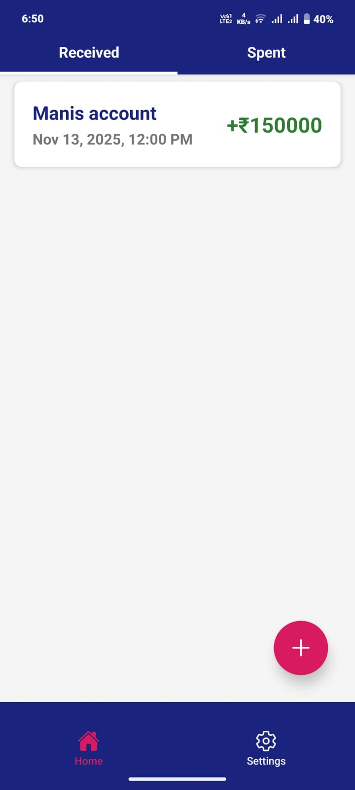
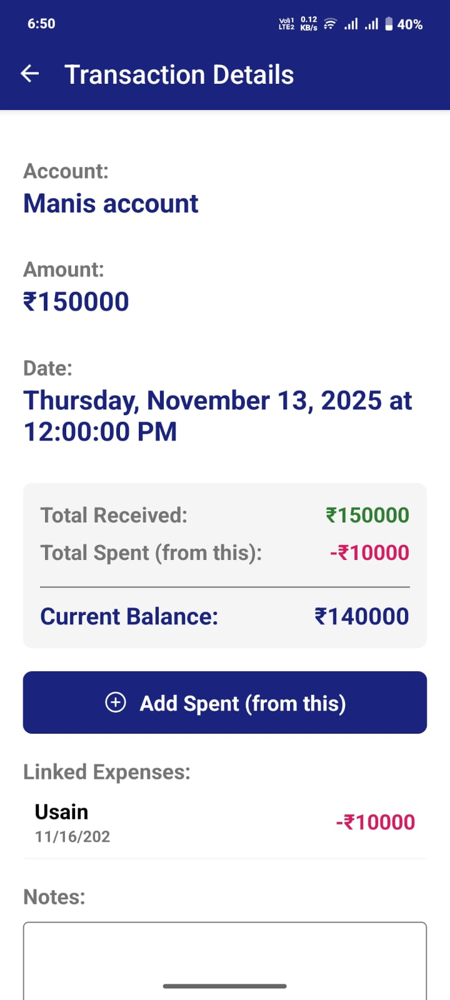
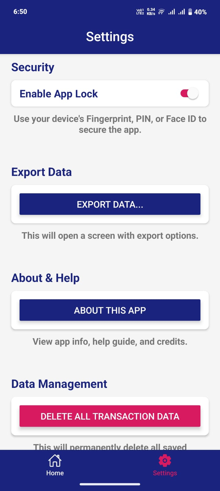

🪙 FinanceTrackerApp

A secure, personal, and powerful offline-first finance manager built with React Native + Expo.

This app was created to solve a real-life need — tracking money received from a family member working and monitoring how that money is spent over time.

📸 Screenshots

✨ Core Features

This isn't just a simple notes app — it’s a full-featured finance management tool.

💰 Transaction Management
🟢 Separate "Received" & 🔴 "Spent" Lists

Efficiently track incoming funds and outgoing expenses with clear categorization.

🔗 Linked Expenses

Link multiple Spent transactions directly under a Received income source — giving you a transparent breakdown of where each rupee goes.

💵 Real-Time Balance Tracking

Automatically calculates the remaining balance for every income source.

📝 Full CRUD

->Add

->Edit

->Delete

->View

Plus custom notes for each transaction.

🔐 Security & Data Protection
🔒 App Lock

Uses your device's:

->Face ID

->Fingerprint

->PIN

to protect your financial data.

📤 Custom CSV Export

->Export filtered transaction data:

->Received by date

->Spent by category

->Linked transactions

->Custom ranges

Useful for long-term audits or sharing reports.

🗑️ Data Control

"Delete All Data" button for quick, safe reset.

📶 Offline-First Architecture

All data stored locally using AsyncStorage.
No internet needed.

🎨 Polished UI & UX

->Dual-tab navigation (Top + Bottom)

->Professional blue, white, red/pink color scheme

->Custom splash screen + app icon

->Dedicated Help & About page

->Clean interface designed for real-world usability.

🛠️ Tech Stack
*Framework

->React Native

->Expo (Managed Workflow)

->Navigation

->React Navigation
(Stack, Bottom Tabs, Material Top Tabs)

->Local Storage

@react-native-async-storage/async-storage

->Authentication / Security

->expo-local-authentication

->File System & Sharing

->expo-file-system

->expo-sharing

->UI Components

->react-native-modal-datetime-picker

@react-native-picker/picker

🚀 How to Run Locally

!!!  Clone the repository:

git clone https://github.com/Mahendiran-10-07/FinanceTrackerApp.git

!!!  Move into the project:

cd FinanceTrackerApp

!!!  Install dependencies:

npm install

!!!  Start development mode:

npx expo start

!!!  Scan the QR code with Expo Go on your mobile device.

📱 Build APK (Production)

!!!  Install EAS CLI:

npm install -g eas-cli

!!!  Log in to Expo:

eas login

!!!  Configure the build:

eas build:configure

!!!  Create a preview APK:

eas build --profile preview -p android --clear-cache

👤 Created By

Built with ❤️ by mahi
